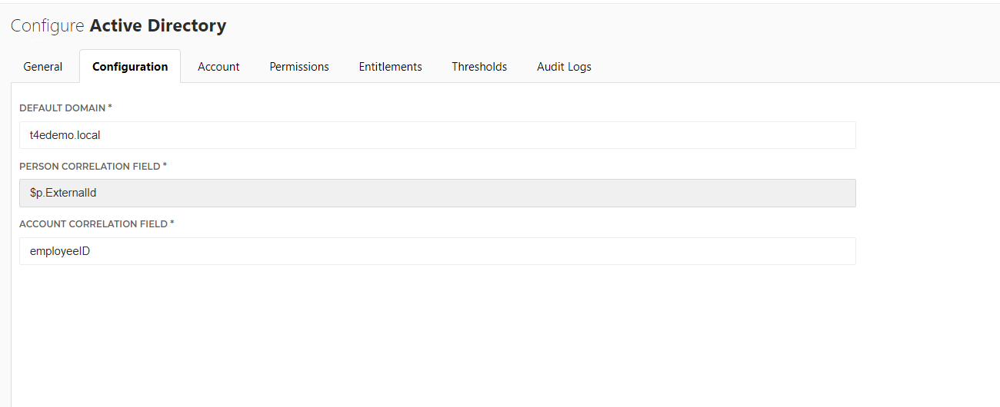

# HelloID-Conn-Prov-Target-ActiveDirectory

  

This is a native connector. This repo is for additional tools specific to Active Directory

## Table of Contents
* [Getting Started](#getting-started)
* [Setup the PowerShell Connector](#setup-the-powershell-connector)
* [Automation Task](#automation-tasks)

## Getting Started
* Create user account 
* Enable user account
* Disable user account
* Delete user account
* Manage permissions (grant / revoke)
  * Group Membership
  * Home Directory creation

## Setup the PowerShell connector
1. Add a new 'Target System' to HelloID and make sure to import all the necessary files.

    - [ ] configuration.json
    - [ ] create.ps1
    - [ ] dynamicPermission.HomeDirectory.ps1

2. Fill in the required fields on the 'Configuration' tab. 

## Automation Tasks
* **Automated Deletion of Accounts**
  * This automation will find disabled AD accounts and set a timestamp for when the account should be deleted. The script then evaluates the timestamps in AD and deletes any accounts that are expired.

_For more information about our HelloID PowerShell connectors, please refer to our general [Documentation](https://docs.helloid.com/hc/en-us/articles/360012557600-Configure-a-custom-PowerShell-source-system) page_